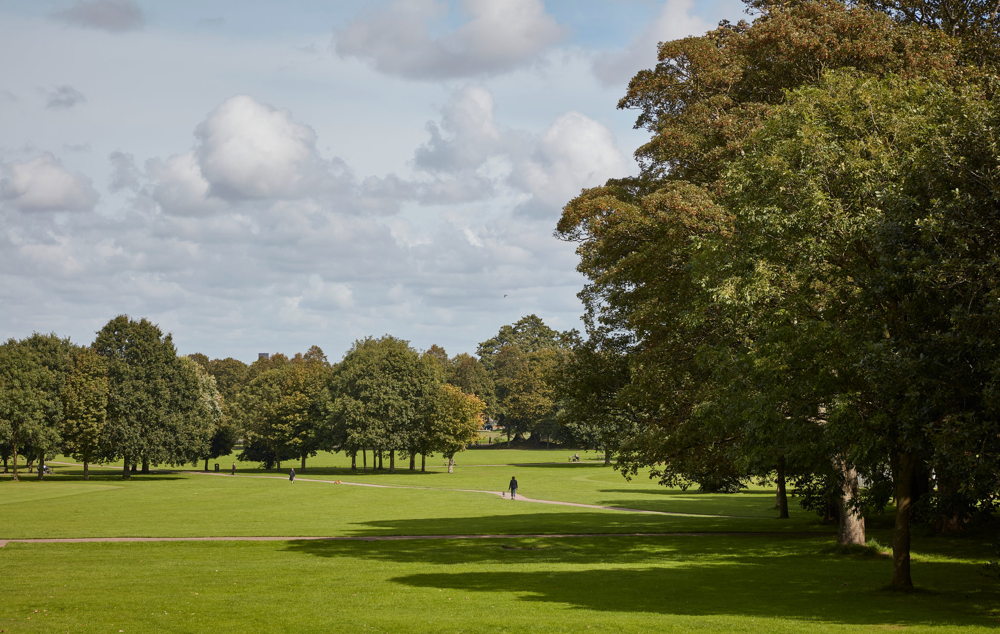

<link rel="stylesheet" href="https://www.w3schools.com/w3css/4/w3.css">

    

        

            
            

                <a class="w3-text-white" style="text-shadow:2px 2px 0 #444" href='categories/live_entertainment.html'>Live Entertainment</a>
            

        

    
  

    

        

            
            

                <a class="w3-text-white" href='categories/museums.html'>Museums</a>
            

        

    
  

    

        

            
            

                <a class="w3-text-white" href='categories/parks_and_trails.html'>Parks</a>
            

        

    
  

    

        

            
            

                <a class="w3-text-white" href='categories/restaurants.html'>Restaurants</a>
            

        

    
 

Done? [Click here to finalize your plan](planner.md).