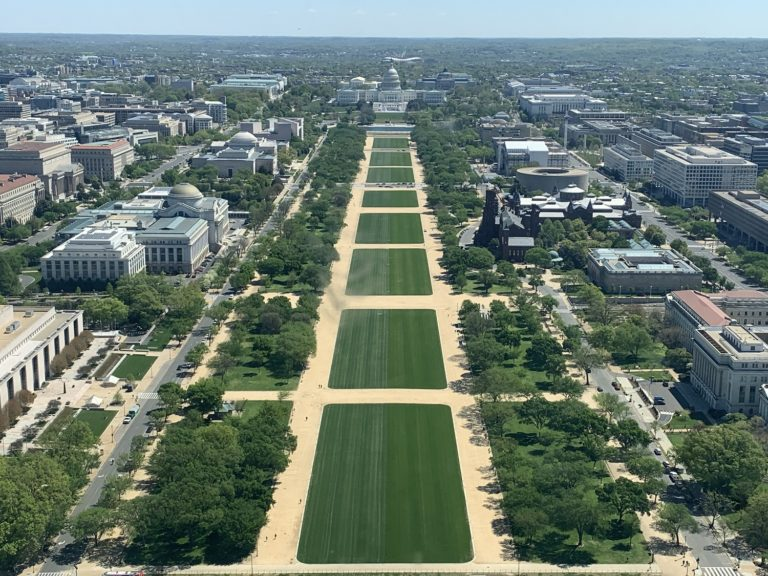

<!-- TODO The following text should go on a side panel -->

    <h1 class="w3-center">Plan a trip to DC!</h1>

    <!-- Some CSS is from here: https://www.w3schools.com/css/tryit.asp?filename=trycss_align_image -->
    

     

    <a class="w3-button w3-block w3-white w3-border w3-large" href="categories.html">
        Click here to plan your visit to DC!
    </a>

